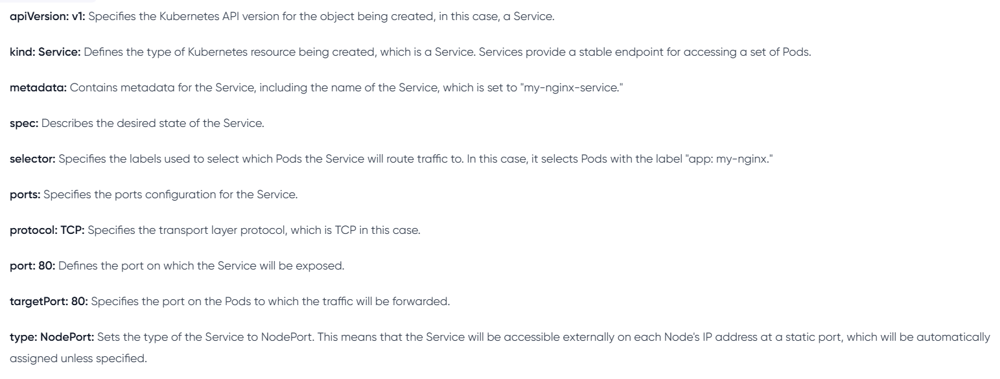

# KUBERNETES RESOURCES

## INTRODUCTION TO YAML

A kubernetes YAML file is a plain text written in YAML syntax that define and describes kubernetes resources. It is ahuman readable data serialization format that is commonly used for configuration files.
It serves as a declarative ways to specify the desired state of the resources such as pods, container, service deployment you want to deploy and manage within a k8s cluster.

### Basic Structure of K8s file:

YAML uses indentation to define the hierachy of data, and it uses whitespace for indentation.

    key1: value1
    key2:
      subkey1: subvalue1 
      subkey2: subvalue2
    key3:
      - item1
      - item2
  
### Data type:

### i. Scalars
Scalars are single values.

* Strings 

``name: John Doe``

* Numbers

``age: 25``

* Booleans

``is_student: true``

### ii. Collections

* List (Arrays)

~~~
fruits: 
- apple
- banana
- orange
~~~~

* Maps (Key value pairs)
 ~~~~ 
  person:
   name: Alice
   age: 30
~~~~

## iii. Nested Structure: 
YAML allows nesting of structures.

~~~~
employee:
  name: John Doe
  position: developer
  skills:
    - Python
    - JavaScript
~~~~

## iv. Comments

In YAML, comments starts with "#"

~~~~
# This is a comment
key: value
~~~~

## v. Multiline strings

Multiline strings can be represented using the "|" or ">" character

~~~~
description: |
  This is a multiline
  string in YAML.
~~~~

## vi. Anchores ans alias

You can use "&" to create an anchor and "*" to craete alias.
~~~~
first: &name John
second: *name
~~~~

In this example, "second" has same value as "first".

## DEPLOYING APPLICATIONS IN KUBERTNETES.

Deployment involves the process of taking application codes and running it in kubernetes cluster, ensuring that it scales, manages resources efficiently and stays resilient. 

### Deployments in kubernetes: 
In kubernetes, deployment is a declarative approach to managing and scaling applications. 
Deployment are the cornerstone for maintaining application consistency and availabity.

### Services in Kubernetes:
In kubernetes, a service is an abstration that define a logical set of pods and a policy by which to access them. It acts as a stable endpoint to connect your applications, allowing for easy communication within the cluster or from external sources. 

TYPES OF SERVICES INCLUDES:
1. Cluster IP: Purpose: The defualt type: Exposes the service on a cluster ip. Accesible only within the cluster.
2. Nodeport: Exposes the service on each Node´s IP on a static port(Nodeport). Accessible externally using Node IP
3. Loadbalancer: Exposes the serveice externally using a cloud provider´s loadbalancer. Accessible externally using the loadbalacer IP.

### Deployin a minikube sample application 
Using YAML files for depoyment and services in kubernetes is like crafting a detailed plan for your applications, while direct deployment with `kubectl` command is more like giving quick, on-the-spot instructions to launch and manage your applications. 

``kubectl create deployment hello-minikube --image=kicbase/echo-server:1.0``

The command above creates a kubernetes deployment named `hello-minikube` running the kicbase/echo-server:1.0 container.

``kubectl expose deployment hello-minikube --type=NodePort --port=8080``

The command above exposes the deployment named hello-minikube as NodePort service on port 8080

``kubectl get services hello-minikube``

The easiest way to access this service is let minikube launch a web server for you minikube service hello-minikube.

### Working with YAML Files:

i. create a new folder `my-nginx-yaml`
ii. Create a new file `nginx-deployment.yaml`

~~~~ 
apiVersion: apps/v1
kind: Deployment
metadata:
  name: my-nginx-deployment
spec:
  replicas: 1
  selector:
    matchLabels:
      app: my-nginx
  template:
    metadata:
      labels:
        app: my-nginx
    spec:
      containers:
      - name: my-nginx
        image: dareyregistry/my-nginx:1.0
        ports:
        - containerPort: 80 
        
~~~~

### apiVersion:
 apps/v1: Specifies the kubernetes API version for the object being created. In this case a deployment in the apps group.

### kind: Deployment:
Defines the type of kubernetes resources being created, which is deployment.

### metadata: 
Containers metadata for the deployment, including the name of the deployment, which is set to my-ngix-deployment.
### spec: 
Describes the desired state of the Deployment.

### replicas: 1: 
Specifies that the desired number of replicas(Instances) of the pod controlled by the deployment is 1

### selector: 
Defines how the deployment selects which pod to manage. In this case it uses the label ``app: my-nginx`` to match pod.

### template: 
specifies the template for creating new pod.

### metadata: 
Contains label for the pods, and in this case, the label is set to ``app: my-nginx``

### spec:
Describes the pod specification.
### containers:
Defines the container within the pod

### name: 
``my-nginx: Sets the name of the container to ``my-nginx``

### image: darey/registry/my-nginx:1.0: 
Specifies the docker image to be used for the nginx container. 

### ports: 
Specifies the port mapping for the container, and in this case, it exposes port 80

iii. Create a new file name ``nginx-service.yaml and paste the content below.

~~~~
apiVersion: apps/v1
kind: Deployment
metadata:
  name: my-nginx-deployment
spec:
  replicas: 1
  selector:
    matchLabels:
      app: my-nginx
  template:
    metadata:
      labels:
        app: my-nginx
    spec:
      containers:
      - name: my-nginx
        image: dareyregistry/my-nginx:1.0
        ports:
        - containerPort: 80

~~~~
A break down of the content below:

iv. Run the command below for the deployment of the cluster.

``kubectl apply -f nginx-deployment.yaml``

``kubectl apply -f nginx-service.yaml``

v. Verify your deployment

``kubectl get deployments``

``kubectl get services``

vi. Access your deployment

``minikube service my-nginx-service --url``

Follow the ip address to access your application on the web server.

